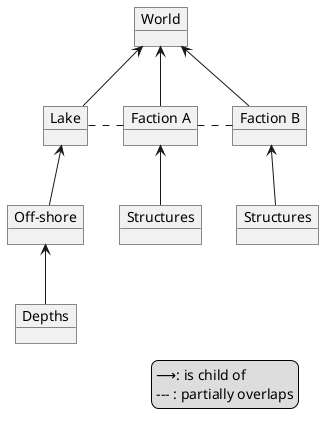

The following document describes the precise meaning and usage of various words used in the JADE specification to prevent confusion.

# 1. Glossary
This chapter includes a table of alphabetically sorted terminology to serve as a "cheat-sheet".
If you have not already done so, it is highly recommended to give the other chapters a cursory read, since there may be more technical nuance then displayed here.
All JADE-specific terminology is capitalised to differentiate from alternate usages.

| Term                | Description                                           |
| ------------------- | ----------------------------------------------------- |
| Atom                | Entity which uniquely occupies space within a World   |
| Attribute           | dynamic information of Atom; either State or Property |
| Being               | Entity which shares space within a World              |
| Down                | negative along a Global Z-axis                        |
| East                | positive along a Global X-axis                        |
| Entity              | spacial object in a World; either Atom or Being       |
| Global              | based on the coordinate system of a World             |
| JADE                | the JADE Algorithmic Design Engine technical standard |
| JADE Implementation | language implementation of the JADE Specification     |
| JADE Specification  | see JADE                                              |
| North               | positive along a Global Y-axis                        |
| Property            | Attribute inherent to an Atom (typically constant)    |
| Scope               | spacial region in a Simulation with local Attributes  |
| Simulation          | a program using a JADE implementation                 |
| South               | negative along a Global Y-axis                        |
| State               | attribute of an Atom describing its current condition |
| Up                  | positive along a Global Z-axis                        |
| West                | negative along a Global X-axis                        |
| World               | highest-level Scope of a Simulation                   |

# 2. Data and Modeling

## 2.1. Simulation
A Simulation is any program making use of a JADE Implementation, usually with the intention of generating a product using algorithmic generation.
Such a product can take on any number of formats, representing information in various degrees of dimension, such as: 
1. A story written in a natural language as a text file or for speech synthesis
2. A technical drawing, to be displayed on a user interface or printed on a fax machine
3. A 3D model, for use in a video-game or to be 3D printed

Currently, JADE is only designed to handle information that can be represented in a three-dimensional mathematical matrix, but future versions may not be bound to these constraints.

A Simulation may contain any number of Worlds, each with their own Scopes and Entities. This allows for Simulations to take place across the boundries of any one medium. While each World is finite by its very nature, there is nothing preventing the user from creating Worlds dynamically to create a Simulation spanning an effectively infinite space.

### 2.1.1. Scopes
Scopes are spacial regions, or sub-sections, in a Simulation that may define their own events or attributes.
They are typically used to organise information hierarchically, and adhere to the following rules:
1. A child Scope must always be within the Shape of its parent
2. Scopes may overlap
3. A Scopes may be fragmented and consist of complex shapes

The following is an example of how Scopes may exist in a world, with a component diagram showing the relationship between the Scopes used.

The World is a subclass of Scope, and represents the highest-level scope in a Simulation, posessing no parent Scope. 
It defines the rules and settings of a World, and stores information on all the Scopes and Entities within it.

Whenever something is considered "Global", it referrs to the state relative to the World.

### 2.1.2. Entities

### 2.1.3. Events

### 2.1.4. Attributes, States and Properties
States and properties are both considered to be attributes of an object.
While the state of an object may change over time, the properties of an object are inherent and are based on e.g. its composition.

For example, a brick might have attributes describing its shape and colour, as well as that it is currently part of a wall. In this case the shape and colour are an inherent and unchangeable part of the brick, which is why they should be properties.
The fact that the brick is part of a wall describes its current condition, hence it should be a state.

If an attribute is listed as both a state and a property, then the state takes priority.
For example, if the previously described brick is painted, then it may have the colour as its current condition, but it also has an inherent colour. The painted colour takes priority over the inherent colour

# 3. Interfaces

# 4. Extensions

# 5. Plug-Ins

## Positioning
JADE follows the convention of a right-handed, "Z-is-up" 3D cartesian coordinate system, where 2D-only applications use "Y-is-up" within the same space.
When translating to non-JADE systems, these coordinates *must be adjusted appropriately*, irrespective of alternate definitions of e.g. cardinal directions.

Point: Vector aligned with global coordinate system
Position: Vector aligned with local coordinate system
Orientation: Rotation relative to global coordinate system

Distance: length of path from start to end
Displacement: shortest distance from start to end

### Translation

East / West (global X translation)
North / South (global Y translation)
Up / Down (global Z translation)

Ahead / Behind (local X translation)
Left / Right (local Y translation)
Above / Below (local Z translation)

### Orientation
Orientation and direction are described using rotations relative to their initial orientation/direction

Orientation (static)
Direction (dynamic)
Rotation (change in orientation)

Alpha (global X rotation)
Beta (global Y rotation)
Gamma (global Z rotation)

Roll (local X rotation)
Pitch (local Y rotation)
Yaw (local Z rotation)

Clockwise (negative rotation along axis)
Counterclockwise (positive rotation along axis)

## Camera
Dolly (local X translation)
Truck (local Y translation)
Pedestal (local Z translation)

Dutch (local X rotation)
Tilt (local Y rotation)
Pan (local Z rotation)

Certain terminology is always reserved for certain concepts:
| Terminology | Vector (rel) | Rotation (rel in °) | Vector (abs) | Rotation (abs in °) |
| ----------- | ------------ | ------------------- |
| Up          | (0, 0, 1)    |
| Down        | (0, 0, -1)   |
| North       | (0, 1, 0)    |
| South       | (0, -1, 0)   |
| Front       | (1, 0, 0)    |
| Back        | (-1, 0, 0)   |
