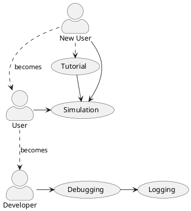

# Use Cases
This documents lists various use-cases and aspects pertaining to them.

# 1. First-time User

## 1.1. Tasks

# 2. Advanced User

## 2.1. Tasks

# 3. Developer

## 3.1. Needs

...

## 3.x.1. JADE implementations

## 3.x.2. Extensions

## 3.x.3. Plug-ins